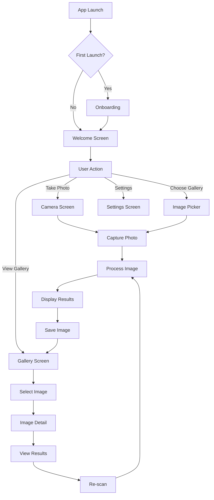
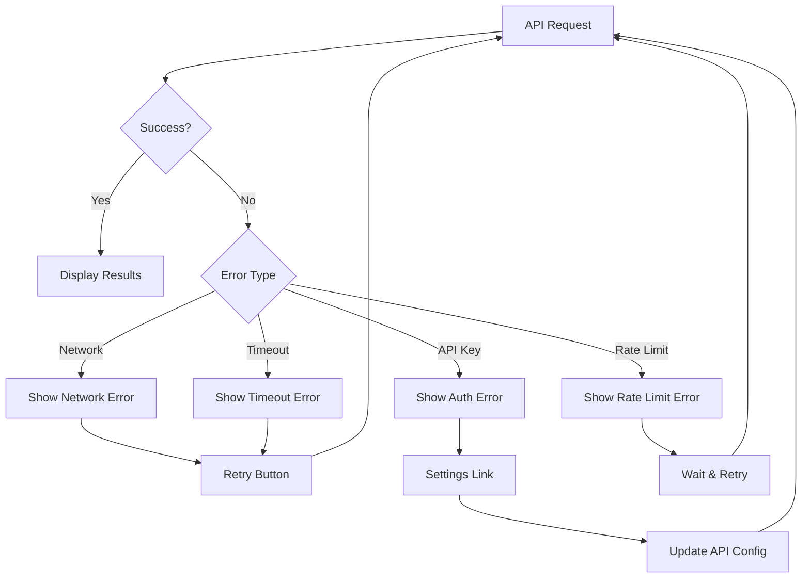
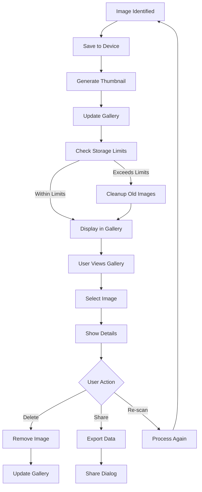

# UI/UX Design and Flow Diagrams

## Overview
AniVision features an intuitive, user-friendly interface designed for seamless species identification and image management. The design follows Material Design principles with a focus on accessibility, performance, and user engagement.

## Design Principles

### Core Principles
1. **Simplicity**: Minimal, clean interface with clear visual hierarchy
2. **Accessibility**: WCAG 2.1 AA compliance with support for screen readers and high contrast
3. **Performance**: Smooth animations and responsive interactions
4. **Consistency**: Unified design language across all screens
5. **Discovery**: Intuitive navigation and feature discovery

### Visual Design Language
- **Primary Colors**: Deep blue (#1976D2) for primary actions, teal (#009688) for secondary
- **Neutral Palette**: Grays from #FAFAFA to #212121 for text and backgrounds
- **Accent Colors**: Green (#4CAF50) for success, Orange (#FF9800) for warnings, Red (#F44336) for errors
- **Typography**: Roboto font family with clear hierarchy
- **Spacing**: 8dp grid system for consistent spacing
- **Icons**: Material Design icons with consistent styling

## Screen Flow Architecture

### Navigation Structure
```
┌─────────────────────────────────────────┐
│              Navigation Stack            │
├─────────────────────────────────────────┤
│ Welcome Screen (Entry Point)            │
│ ├── Camera Screen                       │
│ ├── Gallery Screen                      │
│ └── Settings Screen                     │
│     │                                   │
│     └── Image Detail Screen             │
│         │                               │
│         └── Result Panel (Modal)        │
└─────────────────────────────────────────┘
```

### Drawer Navigation
```
┌─────────────────────────────────────────┐
│            Navigation Drawer             │
├─────────────────────────────────────────┤
│ • Home                                  │
│ • Gallery                               │
│ • Settings                              │
│ • About                                 │
│ • Help & Support                        │
└─────────────────────────────────────────┘
```

## Screen-by-Screen Design

### 1. Welcome Screen
**Purpose**: Primary entry point with quick access to main features

**Layout Structure**:
```
┌─────────────────────────────────────────┐
│ Header Bar                              │
│ ┌─────────────────────────────────────┐ │
│ │ ☰ AniVision                    ⚙️  │ │
│ └─────────────────────────────────────┘ │
├─────────────────────────────────────────┤
│                                         │
│         App Logo & Tagline              │
│                                         │
│     "Discover Nature's Diversity"       │
│                                         │
├─────────────────────────────────────────┤
│                                         │
│    ┌─────────────────────────────┐      │
│    │     📷 Take Photo          │      │
│    └─────────────────────────────┘      │
│                                         │
│    ┌─────────────────────────────┐      │
│    │     🖼️ Choose from Gallery │      │
│    └─────────────────────────────┘      │
│                                         │
├─────────────────────────────────────────┤
│                                         │
│         Recent Identifications           │
│    ┌─────────┐ ┌─────────┐ ┌─────────┐  │
│    │ Image 1 │ │ Image 2 │ │ Image 3 │  │
│    └─────────┘ └─────────┘ └─────────┘  │
│                                         │
└─────────────────────────────────────────┘
```

**Interaction Flow**:
1. User opens app → Welcome screen displays
2. Hamburger menu opens drawer navigation
3. Settings button opens settings screen
4. "Take Photo" button opens camera
5. "Choose from Gallery" opens image picker
6. Recent images show last 3 identified species
7. Tapping recent image opens detail view

**State Management**:
- Loading state for recent images
- Error state if API configuration is missing
- First-time user onboarding overlay

### 2. Camera Screen
**Purpose**: Capture photos for species identification

**Layout Structure**:
```
┌─────────────────────────────────────────┐
│ Camera Header                           │
│ ┌─────────────────────────────────────┐ │
│ │ ← Camera                Flash ⚡    │ │
│ └─────────────────────────────────────┘ │
├─────────────────────────────────────────┤
│                                         │
│         Camera Preview Area             │
│                                         │
│     ┌─────────────────────────────┐      │
│     │                             │      │
│     │     Live Camera Feed        │      │
│     │                             │      │
│     └─────────────────────────────┘      │
│                                         │
├─────────────────────────────────────────┤
│                                         │
│    ┌─────────────────────────────┐      │
│    │        📷 Capture           │      │
│    └─────────────────────────────┘      │
│                                         │
└─────────────────────────────────────────┘
```

**Interaction Flow**:
1. Camera initializes with permission request
2. Live preview displays with overlay guides
3. Flash toggle for low-light conditions
4. Capture button takes photo
5. Image processing overlay shows progress
6. Automatic navigation to results

**Gesture Support**:
- Tap to focus
- Pinch to zoom
- Swipe to switch between front/back camera
- Long press for burst mode

### 3. Gallery Screen
**Purpose**: Browse and manage identified images

**Layout Structure**:
```
┌─────────────────────────────────────────┐
│ Gallery Header                          │
│ ┌─────────────────────────────────────┐ │
│ │ Gallery               🔍 ⋯ ⚙️       │ │
│ └─────────────────────────────────────┘ │
├─────────────────────────────────────────┤
│                                         │
│    ┌─────────┐ ┌─────────┐ ┌─────────┐  │
│    │ Image 1 │ │ Image 2 │ │ Image 3 │  │
│    │ Species │ │ Species │ │ Species │  │
│    └─────────┘ └─────────┘ └─────────┘  │
│                                         │
│    ┌─────────┐ ┌─────────┐ ┌─────────┐  │
│    │ Image 4 │ │ Image 5 │ │ Image 6 │  │
│    │ Species │ │ Species │ │ Species │  │
│    └─────────┘ └─────────┘ ──────────┘  │
│                                         │
├─────────────────────────────────────────┤
│                                         │
│         Pull to Refresh                 │
│                                         │
└─────────────────────────────────────────┘
```

**Interaction Flow**:
1. Grid displays thumbnails with species names
2. Pull-to-refresh updates the gallery
3. Search filters images by species
4. Long press enters selection mode
5. Tap opens image detail view
6. Swipe between images in detail view

**Features**:
- Infinite scroll for large galleries
- Sort by date, species, or confidence
- Multi-select for batch operations
- Filter by identification confidence

### 4. Image Detail Screen
**Purpose**: View detailed identification results

**Layout Structure**:
```
┌─────────────────────────────────────────┐
│ Detail Header                          │
│ ┌─────────────────────────────────────┐ │
│ │ ← Image Detail          📤 🗑️ ⋯   │ │
│ └─────────────────────────────────────┘ │
├─────────────────────────────────────────┤
│                                         │
│         Full Resolution Image           │
│     ┌─────────────────────────────┐      │
│     │                             │      │
│     │                             │      │
│     │        Image Content        │      │
│     │                             │      │
│     │                             │      │
│     └─────────────────────────────┘      │
│                                         │
├─────────────────────────────────────────┤
│                                         │
│    ┌─────────────────────────────┐      │
│    │      🔄 Re-scan Image       │      │
│    └─────────────────────────────┘      │
│                                         │
└─────────────────────────────────────────┘
```

**Interaction Flow**:
1. Image displays with zoom/pan capabilities
2. Swipe up to reveal identification results
3. Re-scan button triggers new analysis
4. Share button exports image and data
5. Delete button removes image with confirmation

**Gestures**:
- Pinch to zoom
- Pan to move around zoomed image
- Double tap to zoom in/out
- Swipe up/down for results panel

### 5. Settings Screen
**Purpose**: Configure API and app preferences

**Layout Structure**:
```
┌─────────────────────────────────────────┐
│ Settings Header                        │
│ ┌─────────────────────────────────────┐ │
│ │ ← Settings                   💾    │ │
│ └─────────────────────────────────────┘ │
├─────────────────────────────────────────┤
│                                         │
│ API Configuration                       │
│ ┌─────────────────────────────────────┐ │
│ │ API URL                             │ │
│ │ https://api.openai.com/v1/...      │ │
│ └─────────────────────────────────────┘ │
│                                         │
│ ┌─────────────────────────────────────┐ │
│ │ API Key                             │ │
│ │ sk-...                              │ │
│ └─────────────────────────────────────┘ │
│                                         │
│    ┌─────────────────────────────┐      │
│    │      🧪 Test Connection     │      │
│    └─────────────────────────────┘      │
│                                         │
├─────────────────────────────────────────┤
│                                         │
│ Preferences                             │
│ ┌─────────────────────────────────────┐ │
│ │ ☑️ Auto-save images                │ │
│ │ ☑️ High quality processing          │ │
│ │ ☐ Dark mode                        │ │
│ └─────────────────────────────────────┘ │
│                                         │
└─────────────────────────────────────────┘
```

**Interaction Flow**:
1. API configuration fields with validation
2. Test connection validates credentials
3. Preferences toggle with immediate effect
4. Save button persists all changes
5. Reset to defaults option

### 6. Result Panel (Modal/Overlay)
**Purpose**: Display identification results

**Layout Structure**:
```
┌─────────────────────────────────────────┐
│ Results Panel                          │
│ ┌─────────────────────────────────────┐ │
│ │ Species Identification Results      │ │
│ └─────────────────────────────────────┘ │
│                                         │
│ ┌─────────────────────────────────────┐ │
│ │ 🦁 African Lion                    │ │
│ │ Panthera leo                       │ │
│ │ Confidence: 95%                    │ │
│ └─────────────────────────────────────┘ │
│                                         │
│ Summary                                │
│ "A large African lion displaying..."   │
│                                         │
│ Additional Details                     │
│ • Habitat: Savanna ecosystems          │
│ • Behavior: Social pride structure     │
│ • Conservation: Vulnerable species     │
│                                         │
│    ┌─────────────────────────────┐      │
│    │      📁 Create Folder       │      │
│    └─────────────────────────────┘      │
│                                         │
└─────────────────────────────────────────┘
```

## User Flow Diagrams

### Main User Flow


### Error Handling Flow


### Image Management Flow


## Component Interaction Patterns

### Drawer Navigation Pattern
```typescript
interface DrawerState {
  isOpen: boolean;
  activeRoute: string;
  isAnimating: boolean;
}

const DrawerNavigation = () => {
  const [state, setState] = useState<DrawerState>({
    isOpen: false,
    activeRoute: 'welcome',
    isAnimating: false,
  });
  
  const toggleDrawer = useCallback(() => {
    setState(prev => ({
      ...prev,
      isOpen: !prev.isOpen,
      isAnimating: true,
    }));
  }, []);
  
  const navigateTo = useCallback((route: string) => {
    setState(prev => ({
      ...prev,
      activeRoute: route,
      isOpen: false,
      isAnimating: true,
    }));
  }, []);
  
  return (
    <Drawer
      isOpen={state.isOpen}
      onClose={toggleDrawer}
      isAnimating={state.isAnimating}
    >
      <DrawerContent
        activeRoute={state.activeRoute}
        onNavigate={navigateTo}
      />
    </Drawer>
  );
};
```

### Image Gallery Pattern
```typescript
interface GalleryState {
  images: ImageMetadata[];
  selectedImages: Set<string>;
  viewMode: 'grid' | 'list';
  sortBy: 'date' | 'species' | 'confidence';
  filterBy: string;
}

const ImageGallery = () => {
  const [state, setState] = useState<GalleryState>({
    images: [],
    selectedImages: new Set(),
    viewMode: 'grid',
    sortBy: 'date',
    filterBy: '',
  });
  
  const handleImagePress = useCallback((imageId: string) => {
    navigation.navigate('ImageDetail', { imageId });
  }, [navigation]);
  
  const handleLongPress = useCallback((imageId: string) => {
    setState(prev => ({
      ...prev,
      selectedImages: new Set([...prev.selectedImages, imageId]),
    }));
  }, []);
  
  const handleSortChange = useCallback((sortBy: string) => {
    setState(prev => ({ ...prev, sortBy }));
  }, []);
  
  return (
    <GalleryContainer>
      <GalleryHeader
        viewMode={state.viewMode}
        sortBy={state.sortBy}
        onSortChange={handleSortChange}
      />
      <ImageGrid
        images={state.images}
        selectedImages={state.selectedImages}
        onPress={handleImagePress}
        onLongPress={handleLongPress}
      />
    </GalleryContainer>
  );
};
```

### Result Display Pattern
```typescript
interface ResultState {
  isVisible: boolean;
  result: SpeciesIdentificationResult | null;
  isLoading: boolean;
  error: string | null;
}

const ResultPanel = () => {
  const [state, setState] = useState<ResultState>({
    isVisible: false,
    result: null,
    isLoading: false,
    error: null,
  });
  
  const showResult = useCallback((result: SpeciesIdentificationResult) => {
    setState({
      isVisible: true,
      result,
      isLoading: false,
      error: null,
    });
  }, []);
  
  const hideResult = useCallback(() => {
    setState(prev => ({ ...prev, isVisible: false }));
  }, []);
  
  return (
    <Modal
      isVisible={state.isVisible}
      onDismiss={hideResult}
      animationType="slide"
    >
      <ResultContent
        result={state.result}
        isLoading={state.isLoading}
        error={state.error}
        onClose={hideResult}
      />
    </Modal>
  );
};
```

## Responsive Design

### Breakpoint Strategy
- **Small Screen** (< 360dp): Compact layout with larger touch targets
- **Medium Screen** (360-600dp): Standard layout with balanced spacing
- **Large Screen** (> 600dp): Tablet layout with side panels

### Adaptive Layouts
```typescript
const useResponsiveLayout = () => {
  const { width } = useWindowDimensions();
  
  const isSmall = width < 360;
  const isMedium = width >= 360 && width < 600;
  const isLarge = width >= 600;
  
  return {
    layout: isSmall ? 'compact' : isMedium ? 'standard' : 'large',
    columns: isSmall ? 2 : isMedium ? 3 : 4,
    fontSize: isSmall ? 'small' : isMedium ? 'medium' : 'large',
    spacing: isSmall ? 8 : isMedium ? 16 : 24,
  };
};
```

## Animation and Transitions

### Transition Types
1. **Page Transitions**: Slide left/right for navigation
2. **Modal Transitions**: Fade in with slide up
3. **Component Transitions**: Fade and scale for state changes
4. **Loading States**: Skeleton screens with shimmer effects

### Animation Specifications
```typescript
const animations = {
  pageTransition: {
    duration: 300,
    easing: 'ease-out',
    animation: 'slide-in-right',
  },
  modalTransition: {
    duration: 250,
    easing: 'ease-in-out',
    animation: 'fade-in-up',
  },
  buttonPress: {
    duration: 150,
    easing: 'ease-out',
    animation: 'scale-down',
  },
  loadingShimmer: {
    duration: 1000,
    easing: 'linear',
    animation: 'shimmer',
  },
};
```

## Accessibility Features

### Screen Reader Support
- Semantic HTML structure with proper ARIA labels
- Alternative text for all images
- Live regions for dynamic content updates
- Focus management for modal dialogs

### Visual Accessibility
- High contrast mode support
- Scalable font sizes
- Color-blind friendly palette
- Large touch targets (minimum 44dp)

### Motor Accessibility
- Voice control support
- Switch navigation compatibility
- Gesture alternatives for all actions
- Keyboard navigation support

## Performance Considerations

### Image Loading
- Progressive JPEG loading
- Thumbnail generation for grid views
- Lazy loading for off-screen images
- Memory-efficient image caching

### Animation Performance
- 60fps target for all animations
- Native driver usage where possible
- Reduced motion preferences support
- Hardware acceleration for transitions

### Component Optimization
- React.memo for expensive renders
- Virtual lists for large datasets
- Debounced search inputs
- Optimized re-renders with useCallback/useMemo

## Testing Strategy

### Visual Testing
- Screenshot regression testing
- Visual component library documentation
- Cross-device compatibility testing
- Accessibility testing with screen readers

### Interaction Testing
- User flow integration tests
- Gesture recognition tests
- Form validation tests
- Error state handling tests

### Performance Testing
- Animation frame rate monitoring
- Memory usage profiling
- Battery consumption testing
- Network performance analysis