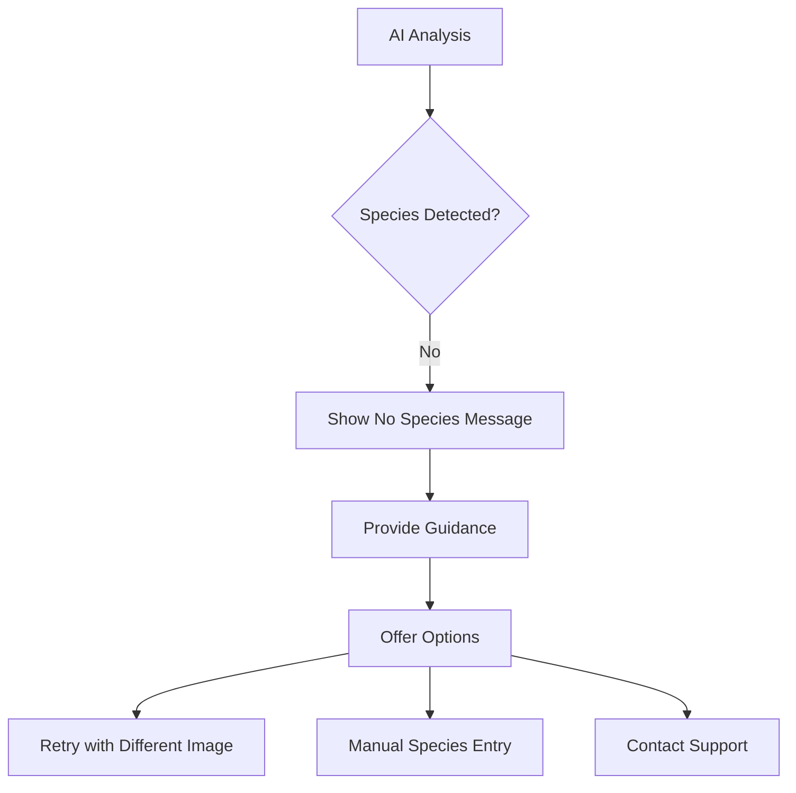

# Edge Case Handling Strategy

## Overview
This document outlines the comprehensive strategy for handling edge cases in the AniVision application, focusing on scenarios where the AI analysis may produce unexpected or challenging results.

## Edge Case Categories

### 1. No Species Detected
**Scenario**: AI cannot identify any animal species in the image

#### Detection Logic
```typescript
class EdgeCaseDetector {
  static detectNoSpecies(response: AIResponse): NoSpeciesResult {
    if (response.error?.includes('no_species_detected')) {
      return {
        type: 'no_species',
        confidence: 0,
        suggestions: [
          'Try a clearer image',
          'Ensure animal is visible',
          'Check image quality'
        ],
        retryOptions: {
          maxRetries: 3,
          alternativePrompts: [
            'enhanced_animal_detection',
            'multiple_species_check',
            'basic_identification'
          ]
        }
      };
    }
  }
}
```

#### User Experience Flow


#### Recovery Strategies
- **Automatic Retry**: Re-analyze with modified prompt
- **User Guidance**: Provide specific feedback on image quality
- **Alternative Detection**: Use different AI models or parameters
- **Manual Override**: Allow manual species entry

### 2. Multiple Species Detected
**Scenario**: Multiple animals present in the image

#### Detection Logic
```typescript
interface MultipleSpeciesResult {
  primarySpecies: SpeciesInfo;
  secondarySpecies: SpeciesInfo[];
  confidence: number;
  detectionStrategy: 'primary_focus' | 'all_equal' | 'user_select';
}

class MultipleSpeciesHandler {
  static analyzeMultipleSpecies(response: AIResponse): MultipleSpeciesResult {
    const species = this.extractSpeciesList(response);
    
    if (species.length === 1) {
      return { primarySpecies: species[0], secondarySpecies: [] };
    }
    
    if (species.length > 1) {
      return this.determinePrimarySpecies(species);
    }
  }
  
  private static determinePrimarySpecies(species: SpeciesInfo[]): MultipleSpeciesResult {
    // Strategy 1: Highest confidence
    const highestConfidence = species.reduce((prev, current) => 
      current.confidence > prev.confidence ? current : prev
    );
    
    // Strategy 2: Largest in frame
    const largestInFrame = this.calculateRelativeSize(species);
    
    // Strategy 3: Center of frame
    const centerFocus = this.calculateCenterDistance(species);
    
    return {
      primarySpecies: highestConfidence,
      secondarySpecies: species.filter(s => s !== highestConfidence),
      confidence: highestConfidence.confidence,
      detectionStrategy: 'primary_focus'
    };
  }
}
```

#### User Interface Strategy
```typescript
const MultipleSpeciesUI = {
  // Primary display
  primaryDisplay: {
    showPrimarySpecies: true,
    highlightSecondary: true,
    allowSelection: true
  },
  
  // Secondary options
  secondaryOptions: {
    showAllSpecies: true,
    allowOverride: true,
    showConfidence: true
  },
  
  // User actions
  userActions: [
    'Select Primary Species',
    'View All Species',
    'Re-analyze for Focus',
    'Add Manual Notes'
  ]
};
```

### 3. Poor Image Quality
**Scenario**: Image quality issues affecting analysis

#### Quality Assessment
```typescript
interface ImageQualityMetrics {
  blurScore: number; // 0-1, lower is better
  brightnessScore: number; // 0-1, optimal is 0.5
  contrastScore: number; // 0-1, higher is better
  noiseLevel: number; // 0-1, lower is better
  resolutionScore: number; // 0-1, higher is better
  overallQuality: number; // Weighted combination
}

class ImageQualityAnalyzer {
  static async analyzeQuality(imageUri: string): Promise<ImageQualityMetrics> {
    const image = await loadImage(imageUri);
    
    return {
      blurScore: await this.calculateBlur(image),
      brightnessScore: await this.calculateBrightness(image),
      contrastScore: await this.calculateContrast(image),
      noiseLevel: await this.calculateNoise(image),
      resolutionScore: this.calculateResolution(image),
      overallQuality: 0 // Calculated from all metrics
    };
  }
  
  static getQualityThresholds(): QualityThresholds {
    return {
      excellent: 0.9,
      good: 0.7,
      acceptable: 0.5,
      poor: 0.3,
      unusable: 0.1
    };
  }
}
```

#### Handling Strategies
```typescript
class PoorQualityHandler {
  static async handlePoorQuality(imageUri: string, analysisResult: AnalysisResult): Promise<HandlingResult> {
    const quality = await ImageQualityAnalyzer.analyzeQuality(imageUri);
    
    if (quality.overallQuality < 0.3) {
      return {
        action: 'reject',
        message: 'Image quality too poor for analysis',
        suggestions: [
          'Use a clearer image',
          'Ensure proper lighting',
          'Check camera focus'
        ],
        autoEnhancement: true
      };
    }
    
    if (quality.overallQuality < 0.5) {
      return {
        action: 'enhance',
        message: 'Image quality is poor, attempting enhancement',
        enhancementOptions: [
          'autoSharpen',
          'brightnessAdjust',
          'contrastIncrease'
        ]
      };
    }
    
    return {
      action: 'proceed',
      message: 'Image quality acceptable for analysis'
    };
  }
}
```

### 4. Long AI Responses
**Scenario**: AI responses exceed token limits or are truncated

#### Detection & Handling
```typescript
interface LongResponseHandler {
  static async handleLongResponse(
    response: AIResponse,
    request: AnalysisRequest
  ): Promise<AnalysisResult> {
    // Check if response is truncated
    if (this.isTruncated(response)) {
      return await this.handleTruncation(response, request);
    }
    
    // Check if response exceeds reasonable limits
    if (this.isTooLong(response)) {
      return await this.handleExcessiveLength(response, request);
    }
    
    return response;
  }
  
  private static async handleTruncation(
    response: AIResponse,
    request: AnalysisRequest
  ): Promise<AnalysisResult> {
    // Strategy 1: Attempt repair
    const repaired = await this.attemptRepair(response);
    if (repaired) return repaired;
    
    // Strategy 2: Re-request with reduced tokens
    const reducedRequest = this.createReducedTokenRequest(request);
    return await this.executeRequest(reducedRequest);
    
    // Strategy 3: Use fallback response
    return this.createFallbackResponse(request);
  }
}
```

#### Progressive Reduction Strategy
```typescript
const ResponseReductionStrategy = {
  levels: [
    {
      level: 1,
      maxTokens: 300,
      prompt: 'standard_species_identification',
      fallback: 'basic_identification'
    },
    {
      level: 2,
      maxTokens: 150,
      prompt: 'essential_species_only',
      fallback: 'minimal_response'
    },
    {
      level: 3,
      maxTokens: 75,
      prompt: 'scientific_name_only',
      fallback: 'manual_entry'
    }
  ],
  
  async applyReduction(request: AnalysisRequest, level: number): Promise<AnalysisResult> {
    const strategy = this.levels[level - 1];
    const modifiedRequest = {
      ...request,
      maxTokens: strategy.maxTokens,
      prompt: strategy.prompt
    };
    
    try {
      return await this.executeRequest(modifiedRequest);
    } catch (error) {
      if (level < this.levels.length) {
        return await this.applyReduction(request, level + 1);
      }
      return await this.applyFallback(strategy.fallback);
    }
  }
};
```

### 5. Network Connectivity Issues
**Scenario**: Intermittent or complete loss of network connectivity

#### Connectivity Detection
```typescript
class ConnectivityMonitor {
  static async checkConnection(): Promise<ConnectivityStatus> {
    const networkState = await NetInfo.fetch();
    
    return {
      isConnected: networkState.isConnected,
      isInternetReachable: networkState.isInternetReachable,
      type: networkState.type,
      quality: networkState.quality,
      latency: await this.measureLatency()
    };
  }
  
  static async handleConnectivityLoss(request: AnalysisRequest): Promise<HandlingResult> {
    const status = await this.checkConnection();
    
    if (!status.isConnected) {
      return {
        action: 'queue',
        message: 'No internet connection. Request queued for retry.',
        queuedUntil: new Date(Date.now() + 5 * 60 * 1000), // 5 minutes
        retryCount: 3
      };
    }
    
    if (status.latency > 5000) {
      return {
        action: 'adapt',
        message: 'Slow connection detected. Using optimized settings.',
        optimizations: [
          'reduceImageQuality',
          'increaseTimeout',
          'useCachedResponse'
        ]
      };
    }
    
    return { action: 'proceed' };
  }
}
```

### 6. API Rate Limiting
**Scenario**: OpenAI API rate limits exceeded

#### Rate Limit Detection
```typescript
class RateLimitHandler {
  private static rateLimitMap = new Map<string, RateLimitInfo>();
  
  static async handleRateLimit(error: AxiosError): Promise<HandlingResult> {
    const rateLimitInfo = this.extractRateLimitInfo(error);
    
    if (rateLimitInfo.type === 'requests_per_minute') {
      return this.handleRequestsPerMinuteLimit(rateLimitInfo);
    }
    
    if (rateLimitInfo.type === 'tokens_per_minute') {
      return this.handleTokensPerMinuteLimit(rateLimitInfo);
    }
    
    return this.handleDailyLimit(rateLimitInfo);
  }
  
  private static async handleRequestsPerMinuteLimit(info: RateLimitInfo): Promise<HandlingResult> {
    const waitTime = this.calculateWaitTime(info);
    
    return {
      action: 'delay',
      message: `Rate limit reached. Retrying in ${waitTime} seconds.`,
      retryAfter: waitTime,
      maxRetries: 3
    };
  }
}
```

### 7. Invalid API Credentials
**Scenario**: API key invalid or expired

#### Credential Validation
```typescript
class CredentialValidator {
  static async validateCredentials(apiKey: string, apiUrl: string): Promise<ValidationResult> {
    try {
      const testRequest = await this.createTestRequest(apiKey, apiUrl);
      const response = await this.executeTest(testRequest);
      
      return {
        isValid: true,
        lastValidated: new Date(),
        capabilities: await this.checkCapabilities(response)
      };
    } catch (error) {
      return {
        isValid: false,
        error: this.classifyError(error),
        suggestions: this.generateSuggestions(error)
      };
    }
  }
  
  private static generateSuggestions(error: Error): string[] {
    if (error.message.includes('invalid_api_key')) {
      return [
        'Check your API key',
        'Verify API key format',
        'Ensure key is active'
      ];
    }
    
    if (error.message.includes('insufficient_quota')) {
      return [
        'Check your billing status',
        'Verify your usage limits',
        'Upgrade your plan'
      ];
    }
    
    return ['Contact OpenAI support'];
  }
}
```

### 8. Device-Specific Issues
**Scenario**: Camera permissions, storage limits, device compatibility

#### Device Compatibility
```typescript
class DeviceCompatibilityHandler {
  static async checkDeviceCompatibility(): Promise<CompatibilityResult> {
    const deviceInfo = await this.getDeviceInfo();
    
    return {
      cameraSupported: this.checkCameraSupport(deviceInfo),
      storageAvailable: this.checkStorageAvailability(deviceInfo),
      performanceAdequate: this.checkPerformance(deviceInfo),
      osVersionSupported: this.checkOSVersion(deviceInfo),
      recommendedSettings: this.generateRecommendedSettings(deviceInfo)
    };
  }
  
  private static async checkCameraSupport(deviceInfo: DeviceInfo): CameraSupportResult {
    return {
      canAccessCamera: await this.checkCameraPermission(),
      cameraQuality: this.assessCameraQuality(deviceInfo),
      supportedFormats: this.getSupportedImageFormats(),
      recommendedQuality: this.getRecommendedQuality(deviceInfo)
    };
  }
}
```

## User Experience Strategies

### Progressive Enhancement
```typescript
const ProgressiveEnhancement = {
  levels: [
    {
      level: 'basic',
      features: [
        'Manual species entry',
        'Basic image storage',
        'Simple gallery view'
      ],
      fallbacks: true
    },
    {
      level: 'standard',
      features: [
        'AI species identification',
        'Automatic image naming',
        'Basic folder organization'
      ],
      fallbacks: 'basic'
    },
    {
      level: 'enhanced',
      features: [
        'Multiple species detection',
        'Advanced image processing',
        'Intelligent folder grouping'
      ],
      fallbacks: 'standard'
    }
  ]
};
```

### Graceful Degradation
```typescript
class GracefulDegradation {
  static async degradeGracefully(error: Error, context: DegradeContext): Promise<DegradationResult> {
    const strategies = await this.selectDegradationStrategies(error, context);
    
    for (const strategy of strategies) {
      try {
        const result = await this.applyStrategy(strategy);
        if (result.success) {
          return {
            degradedLevel: strategy.level,
            remainingFeatures: strategy.availableFeatures,
            userMessage: strategy.userMessage
          };
        }
      } catch (strategyError) {
        // Continue to next strategy
      }
    }
    
    // Final fallback
    return this.applyCompleteFallback();
  }
}
```

## Error Recovery Patterns

### Automatic Recovery
```typescript
class AutomaticRecovery {
  static async recoverAutomatically(error: Error, context: RecoveryContext): Promise<RecoveryResult> {
    const recoveryStrategies = this.selectRecoveryStrategies(error);
    
    for (const strategy of recoveryStrategies) {
      try {
        const result = await this.attemptRecovery(strategy, context);
        if (result.success) {
          return result;
        }
      } catch (recoveryError) {
        // Log and continue
      }
    }
    
    throw new RecoveryFailedError('All automatic recovery strategies failed');
  }
}
```

### User-Assisted Recovery
```typescript
class UserAssistedRecovery {
  static async requestUserAssistance(error: Error, context: UserContext): Promise<UserAssistanceResult> {
    const assistanceOptions = this.generateAssistanceOptions(error, context);
    
    return {
      message: this.generateUserMessage(error),
      options: assistanceOptions,
      requiresUserInput: true,
      timeout: 30000 // 30 seconds to respond
    };
  }
}
```

## Monitoring and Prevention

### Proactive Detection
```typescript
class ProactiveMonitoring {
  static async monitorSystemHealth(): Promise<HealthStatus> {
    const checks = await Promise.all([
      this.checkAPIConnectivity(),
      this.checkStorageSpace(),
      this.checkCameraPermission(),
      this.checkNetworkQuality()
    ]);
    
    return {
      overall: this.calculateOverallHealth(checks),
      issues: this.identifyIssues(checks),
      recommendations: this.generateRecommendations(checks)
    };
  }
}
```

### Predictive Prevention
```typescript
class PredictivePrevention {
  static async predictIssues(imageUri: string, context: PredictionContext): Promise<PredictionResult> {
    const predictions = await this.analyzeImage(imageUri);
    
    return {
      likelyIssues: this.identifyPotentialIssues(predictions),
      recommendedActions: this.suggestPreemptiveActions(predictions),
      confidence: this.calculatePredictionConfidence(predictions)
    };
  }
}
```

## Testing Edge Cases

### Test Scenarios
```typescript
const EdgeCaseTestScenarios = {
  noSpecies: [
    'blank_image',
    'indoor_scene',
    'object_only',
    'extremely_blurry'
  ],
  multipleSpecies: [
    'two_animals',
    'group_shot',
    'zoo_scene',
    'pets_together'
  ],
  poorQuality: [
    'low_light',
    'motion_blur',
    'extreme_closeup',
    'overexposed'
  ],
  longResponses: [
    'complex_scene',
    'detailed_analysis',
    'multiple_asks',
    'excessive_detail'
  ]
};
```

### Automated Testing
```typescript
class EdgeCaseTester {
  static async runEdgeCaseTests(): Promise<TestResults> {
    const scenarios = Object.values(EdgeCaseTestScenarios).flat();
    
    const results = await Promise.all(
      scenarios.map(scenario => this.testScenario(scenario))
    );
    
    return {
      passed: results.filter(r => r.passed),
      failed: results.filter(r => !r.passed),
      coverage: this.calculateCoverage(results),
      recommendations: this.generateRecommendations(results)
    };
  }
}